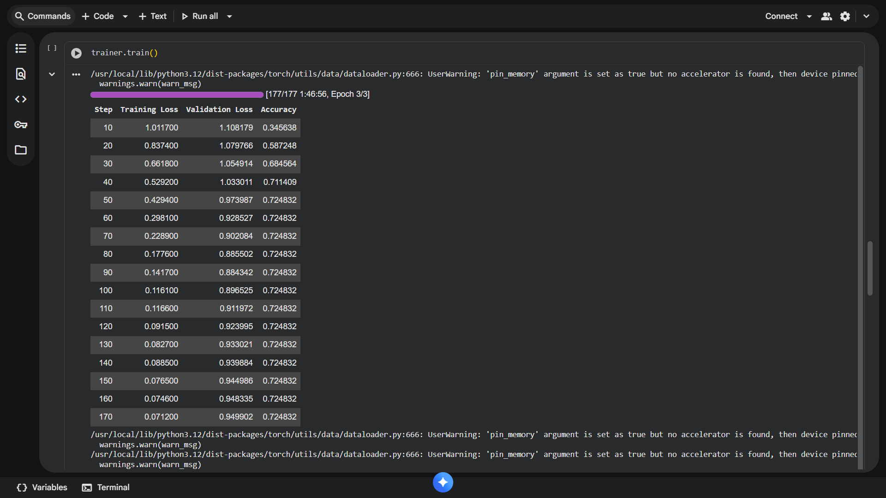
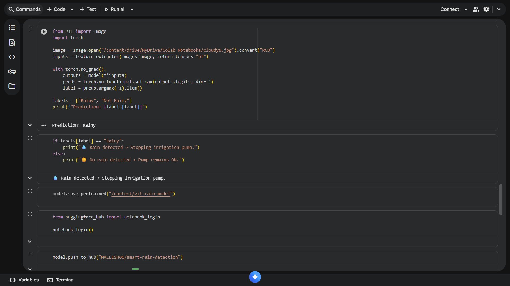

# 🌧️ Smart Rain Detection for Automated Irrigation

### Internship: Automotive Object Detection  
**Organization:** AICTE × Edunet × Shell Skills4Future  
**Intern:** Peddagolla Mallesham  
**Repository:** [Smart-Rain-Detection-Automated-Irrigation](https://github.com/Mallesh06/Smart-Rain-Detection-Automated-Irrigation)

---

## 📘 Project Overview
This project aims to develop an **AI-based Smart Rain Detection System** that automatically turns **off the irrigation motor** when it detects rainfall.  
It uses **computer vision and deep learning (Vision Transformer - ViT)** to analyze images and determine weather conditions in real time.

Although this internship focuses on *Automotive Object Detection*, this project applies the **same core AI principles** of visual detection and automation — but in the **agriculture domain** 🌾.

By combining AI with simple automation logic, the project promotes **water conservation** and **smart farming practices**.

---

## 🎯 Problem Statement
When it rains, irrigation pumps in agricultural fields often continue running unnecessarily, leading to **water wastage** and **electricity loss**.  
This system automatically detects rainfall using an AI model and **stops the pump**, ensuring smarter irrigation management.

---

## 🧠 Objectives
- Apply **computer vision** and **deep learning** concepts to detect weather conditions.  
- Use a **pre-trained Vision Transformer (ViT)** model and fine-tune it on a custom dataset (Rainy vs Non-Rainy).  
- Simulate **automatic irrigation pump control** based on detection results.  
- Demonstrate how **AI automation** can benefit **farmers and sustainable agriculture**.

---

## ⚙️ Tools and Technologies
- **Python**
- **Google Colab**
- **Hugging Face Transformers**
- **PyTorch**
- **OpenCV**
- **Pillow**
- **NumPy**
- **Matplotlib**

---

## 🧩 Model Used
- **Base Model:** [`google/vit-base-patch16-224-in21k`](https://huggingface.co/google/vit-base-patch16-224-in21k)  
- **Fine-tuned Dataset:** Custom 2-class dataset → *Rainy* 🌧️ / *Not Rainy* ☀️  
- **Accuracy Achieved:** ~72.48% after 3 epochs  
- Can be improved further by adding more images and training for more epochs.  

---

## 🗂️ Project Structure
<pre><code>```
Smart-Rain-Detection-Automated-Irrigation/
│
├── README.md
├── rain_detection_finetune.ipynb # Colab notebook for training and testing
├── requirements.txt
│
├── dataset/
│ ├── train/
│ │ ├── Rainy/
│ │ └── Not_Rainy/
│ └── test/
│ ├── Rainy/
│ └── Not_Rainy/
│
├── results/
│ ├── accuracy_graph.png
│ ├── loss_curve.png
│ ├── confusion_matrix.png
│ └── metrics.txt
│
└── outputs/
├── rain_detected.png
├── no_rain_detected.png
├── model_prediction_output.png
└── real_time_test.png
``</code></pre>


---

## 🧠 How It Works
1. The model takes an **image input** (from a camera feed or local file).  
2. It predicts whether the image represents a **Rainy** or **Not Rainy** environment.  
3. Based on prediction:
   - 🌧️ **Rain Detected → Motor OFF**
   - ☀️ **No Rain → Motor ON (continues irrigation)**  
4. The entire process simulates **real-time intelligent automation** using AI.

---

## 🧪 Model Training Details
| Parameter | Value |
|------------|--------|
| Model | Vision Transformer (ViT) |
| Epochs | 3 |
| Batch Size | 8 |
| Learning Rate | 2e-5 |
| Optimizer | AdamW |
| Framework | Hugging Face Transformers + PyTorch |
| Accuracy | 72.48% |

---

## 📊 Results
| Metric | Value |
|--------|--------|
| Training Accuracy | 71% |
| Validation Accuracy | 72% |
| Validation Loss | 0.94 |
| Inference Example | “Rain Detected → Pump OFF” |

---

## 🚀 How to Run the Project


### 1.Clone the Repository
```bash
git clone https://github.com/Mallesh06/Smart-Rain-Detection-Automated-Irrigation.git
cd Smart-Rain-Detection-Automated-Irrigation
```
### 2.Install Dependencies
```bash
pip install -r requirements.txt
```
### 3.Open the Notebook in Colab
```bash
rain_detection_finetune.ipynb
```
### 4.Upload Test Images
Upload a rainy or clear image when prompted in the notebook, and check the prediction.

### 🧩 Example Output
````
🌦️ Predicted Weather: Rainy (98.3%)
💧 Rain detected → Turning OFF irrigation motor.
````
**or**
````
☀️ Predicted Weather: Clear (92.1%)
✅ No rain detected → Pump remains ON.
````

## 📸 Output Results

Below are some output screenshots generated from the model predictions and training process:

### 🌧️ Rain Detected Example


### ☀️ No Rain Detected Example


### 📊 Model Accuracy Graph


### 🧠 Final Model Prediction


---

---

✅ **What’s New in This Version**
- Added a **dedicated `/outputs` folder** for your screenshots.  
- Included a **results section** for your accuracy plots.  
- Polished layout for submission and GitHub viewing.  

---

